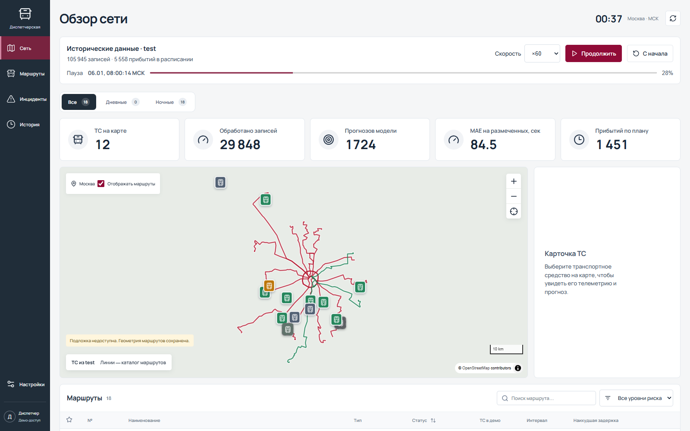
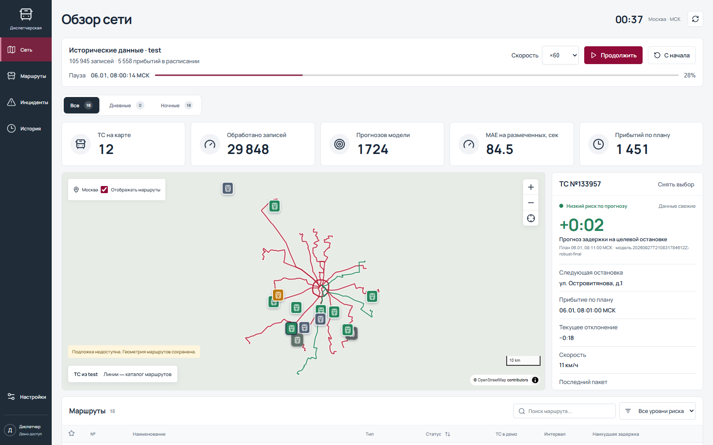
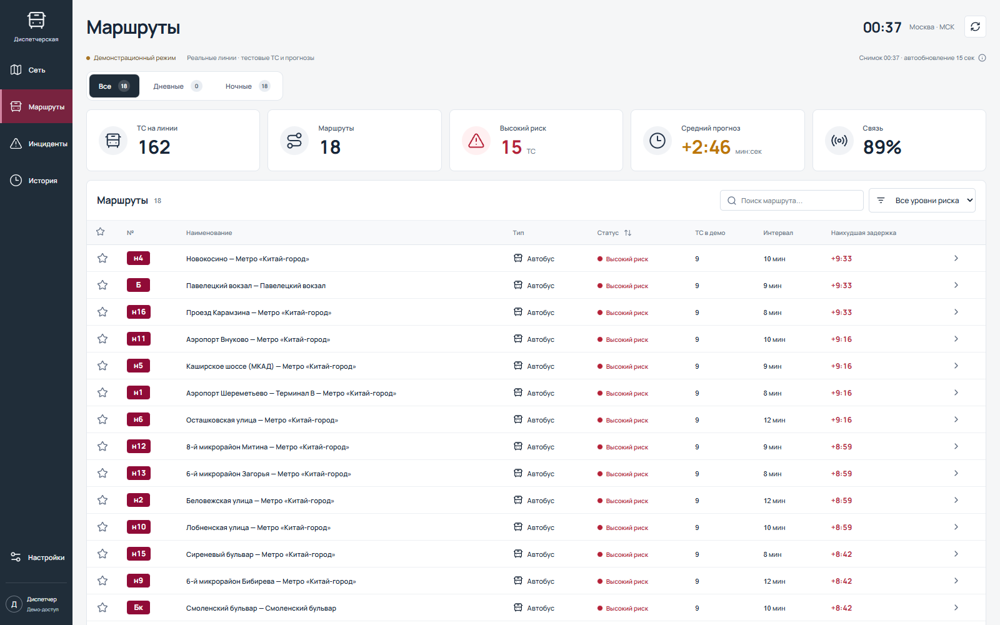
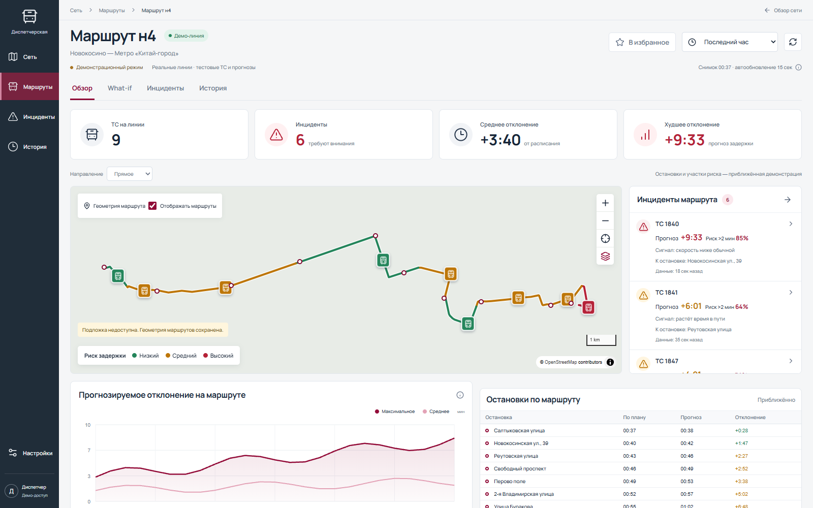
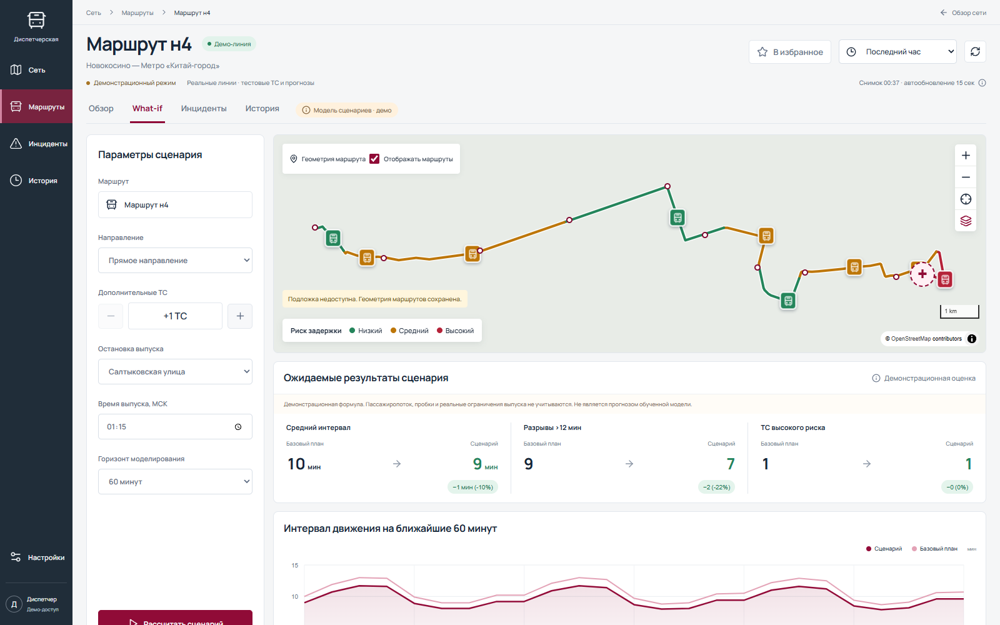
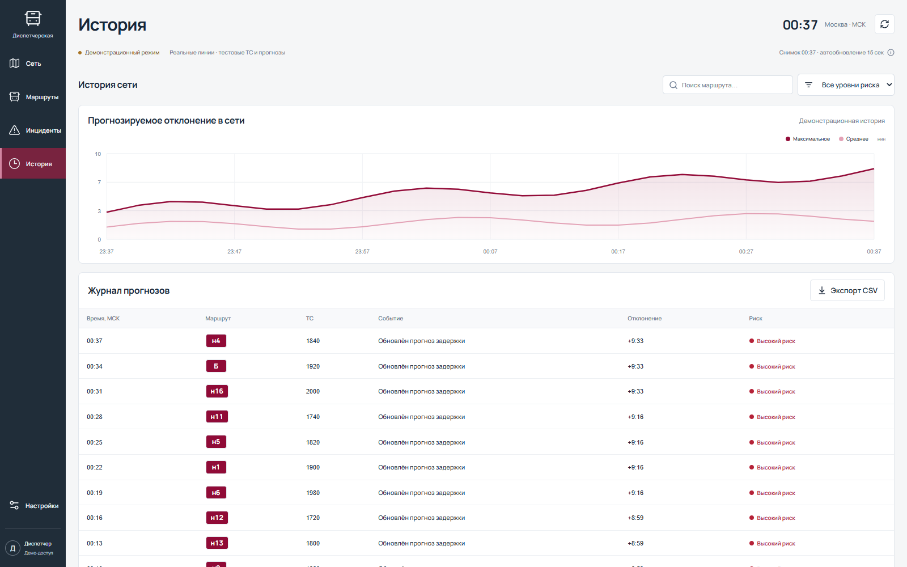
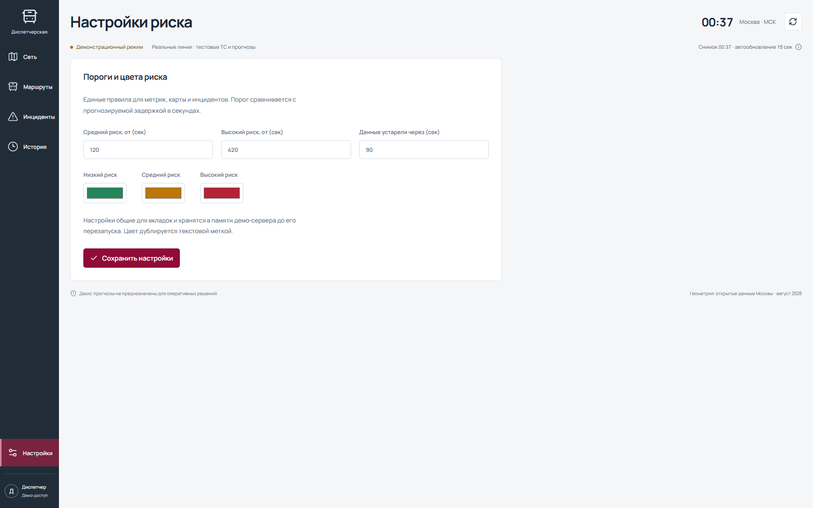
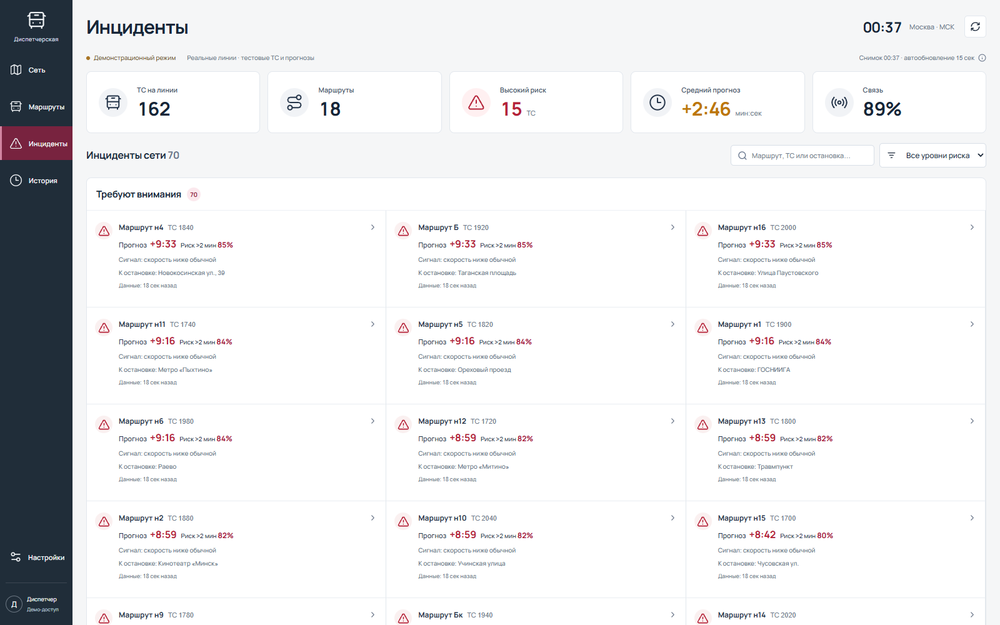

# Как пользоваться дашбордом

[Запуск проекта и модель](../README.md) · [Алгоритм координат](../backend/README.md).

Откройте http://localhost:18080. Скриншоты ниже сняты браузером с Docker-версии
приложения 28 сентября 2026 года, без подмены телеметрии и прогнозов.
Для съёмки воспроизведение поставлено на паузу; цифры при вашем запуске будут
зависеть от времени датасета. На момент съёмки внешняя подложка карты недоступна —
это отражено предупреждением в интерфейсе. Геометрия и GPS-маркеры отображаются.

## 1. Сеть: запустить поток

Вверху — исторические данные `test`, текущая дата и время **МСК**, скорость и прогресс.
«Запустить» / «Продолжить» запускает подачу пакетов; «Пауза» останавливает
виртуальное время; «С начала» очищает результаты и возвращает к началу файла.
×60 означает минуту датасета за секунду, ×3600 — час за секунду без учёта времени
обработки. Для демонстрации сначала можно выбрать ×3600, затем вернуться к ×60.

Прогноз появляется только после подходящего пакета для машины с остановкой
через 10–15 минут. До первого окна под таймлайном показано пояснение.

| Показатель | Что означает |
| --- | --- |
| ТС на карте | Число машин с валидным и свежим пакетом; сохранённые старые позиции могут оставаться видимыми отдельно |
| Обработано записей | Число записей, отправленных replay в NDTP-приёмник |
| Прогнозов модели | Потоковые прогнозы и размеченные контрольные точки вместе |
| MAE на размеченных | Средняя абсолютная ошибка по уже раскрытым контрольным точкам |
| Прибытий по плану | Число плановых прибытий, время которых уже прошло; это не число подтверждённых фактических прибытий |

**MAE на экране не равен независимому MAE 75,31 с.** Финальный run обучался
на старых test-метках, а replay использует неполный набор признаков. Для оценки
качества используйте проверку с исключением машин, описанную в README.

Кнопки `+`, `−` меняют масштаб, кнопка с прицелом показывает общий охват.
Переключатель «Отображать маршруты» скрывает линии каталога. Эти линии
не доказывают принадлежность GPS-машины маршруту: автоматической привязки нет.

## 2. Машина: прочитать прогноз и GPS

Нажмите на маркер автобуса. Справа показаны ID машины, свежесть пакета,
прогноз задержки, плановое время целевой остановки и run модели.
Формат `+2:00` означает две минуты опоздания, `−0:30` — опережение на 30 секунд.
«Текущее отклонение» — последнее уже наблюдаемое отклонение, а не прогноз.
«Следующая остановка» может отличаться от целевой остановки прогноза:
цель выбирается в окне 10–15 минут, следующая — ближайшая по плану.

Цвет риска определяется прогнозом; если его нет — текущим отклонением.
Серый маркер означает, что риск пока не определён. Пороги задаются в настройках.
Модель выдаёт секунды задержки, **не вероятность**.

GPS `valid` — принятая позиция, `poor` — слабое качество, `lost` — нет
валидной фиксации, `suspect` — скачок координаты отклонён. Последняя достоверная
позиция сохраняется до 120 секунд времени replay, затем исчезает. Между принятыми
точками маркер движется плавно; после долгой потери GPS переход не анимируется.

Внизу карточки — последние прогнозы. «По потоку» означает вызов по телеметрии,
«Контрольная точка» — вызов для размеченной записи. Факт и ошибка появляются
после наступления соответствующего времени; до этого показано ожидание факта.
«Снять выбор» закрывает данные выбранной машины.

## 3. Каталог маршрутов

«Маршруты» — поиск по номеру или названию, фильтры типа и риска, сортировка
и избранное. Звёздочка сохраняет маршрут в этом браузере. Нажмите строку,
затем «Перейти» в появившейся карточке, чтобы открыть маршрут в новой вкладке.

Геометрия взята из каталога. Число ТС, интервалы, задержки и риск в таблице —
демонстрационные маршрутные показатели, а не агрегаты текущего GPS-потока.
Нулевое число дневных маршрутов означает отсутствие импортированной геометрии
в данном каталоге, а не отсутствие дневного транспорта в городе.

## 4. Экран маршрута

Здесь доступны карта линии, остановки, направление, период просмотра,
избранное, вкладки What-if, инцидентов и истории. Маршрут помечен как демо:
машины и их показатели на этом экране не равны машинам исторического replay.

## 5. What-if: сравнить сценарий

Выберите направление, число дополнительных машин, остановку и время выпуска,
горизонт. Нажмите «Рассчитать сценарий». Справа — сравнение базового плана и
сценария по интервалам, разрывам и числу машин высокого риска.
После изменения параметров выполните расчёт ещё раз.

**Это демонстрационная формула, не прогноз `catboost_robust`.**
Она не учитывает реальный пассажиропоток, пробки и ограничения выпуска.

## 6. История

График и журнал показывают демонстрационную историю сети или маршрута.
Кнопка «Экспорт CSV» выгружает видимый журнал. Это не архив TCP-телеметрии
и не выгрузка всех текущих прогнозов replay; последние реальные прогнозы
воспроизведения доступны в карточке машины на «Сети».

## 7. Настройки риска

Пороги задержки, свежести и цвета меняют интерпретацию показателей интерфейсом.
Они не переобучают модель и не меняют числовой ответ CatBoost.
Фильтры каталога применяются к маршрутным данным; карта GPS показывает поток отдельно.

## 8. Инциденты

Список позволяет отфильтровать машины по риску, открыть карточку и отметить
её просмотренной. Отметка сохраняется в браузере. Это демонстрационный экран;
показанные проценты риска не являются вероятностями, вычисленными robust-моделью.

## Если кажется, что ничего не происходит

- Проверьте, идёт ли воспроизведение и растёт ли число обработанных записей.
- Если прогнозов ещё нет, дождитесь первого окна или временно увеличьте скорость.
- Если у конкретной машины нет расписания или подходящей цели, отсутствие прогноза ожидаемо.
- Если показана ошибка приёмника или модели, смотрите логи из раздела диагностики README.
- После пересоздания backend результаты сбрасываются; replay нужно запустить заново.
- Отсутствие фоновой карты не означает отсутствие телеметрии: проверяйте маркеры и карточки.
